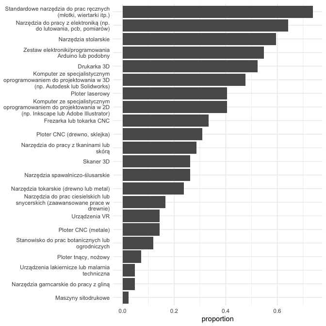

# enlabel: Efficient Labeling for Survey Data in R

## Main features

+ Append meaningful, human-readable descriptions to long format data.
+ Extract labels directly from datasets or LimeSurvey.
+ Convenient labeling for dataframe headers.
+ Export labeled data to Excel.

## Installation

```r
# If you want to use the LimeSurvey API you need to install the limer package first
devtools::install_github("wjk-g/limer")

# Install enlabel
devtools::install_github("wjk-g/enlabel")
```

## Motivation

R’s lackluster support for variable labels is often a source of
frustration, especially when working with survey data. This is because
survey data:

- often contains long labels (i.e. questions asked to respondents);
- comes from environments with native support for labels such as SPSS or
  STATA;
- *has to be frequently transformed from wide to long format* (this is
  particularly true of multiple choice questions).

`enlabel` addresses the last problem in particular - labeling variable
names transformed into values in a long format dataframe. Long format
data, especially in the tidyverse context, lends itself more easily to
certain kinds of analyses and visualisations. However, the output of
these transformations usually comprises (only) numbers and question
codes and can be difficult to read, interpret, and communicate.
`enlabel` provides you with the tools to quickly append meaningful,
human-readable descriptions to your data.

As a bonus, enlabel also provides one quality-of-life function for
labeling dataframe headers. This can be useful when you are planning to
export your data to a different format (e.g. to .xlsx using the `expss`
package).

## Labeling long format data

The example below presents a typical task when working with survey
data - selecting and summarising a group of variables sharing a common
prefix. The names of the pivoted variables (i.e. question codes) are
stored in the “name” column. The data comes from an unpublished study of
Polish makerspaces conducted in 2022. Codes in the name column represent
different kinds of tools and values in the proportion column the share
of makerspaces having a prarticular tool at their disposal.

```r
library(ggplot2)
library(dplyr)
library(tidyr)


df <- haven::read_sav("makerspaces.sav")

tools_summary <- df %>%
  select(starts_with('HW')) %>%
  pivot_longer(everything()) %>%
  count(name, value) %>%
  group_by(name) %>%
  summarise(proportion = n / sum(n), value = value) %>%
  filter(value == "Y") %>% 
  select(-value)

head(tools_summary, 5)
#> # A tibble: 20 × 2
#> # Groups:   name [20]
#>    name       proportion
#>    <chr>           <dbl>
#>  1 HW01_SQ001     0.524 
#>  2 HW01_SQ002     0.262 
#>  3 HW01_SQ003     0.405 
#>  4 HW01_SQ004     0.0714
#>  5 HW01_SQ005     0.310 
```

`enlabel` allows you to source the dataset for labels with
`extract_labels_from_data()`. The function accepts as an argument either
a path to the .sav file or to an R dataframe with a `variable.labels`
attribute. Importing a .sav file with the `foreign` package or using the
“Export to R” functionality in LimeSurvey will both create such objects.
Unfortunately, this does not work with objects imported with the `haven`
package (this means that, in this particular case,
`extract_labels_from_data(df)` is not going to work).

If you are working with only one survey, there is no need to assign the
output of `extract_labels_from_data()` to a variable - it is stored in
cache.

``` r
extract_labels_from_data("makerspaces.sav")
```

``` r
tools_summary %>% append_labels() %>% head(5)
#> # A tibble: 20 × 3
#> # Groups:   name [20]
#>    name       proportion labels                                                 
#>    <chr>           <dbl> <chr>                                                  
#>  1 HW01_SQ001     0.524  [Drukarka 3D] Czy Pana/i pracownia dysponuje następują…
#>  2 HW01_SQ002     0.262  [Skaner 3D] Czy Pana/i pracownia dysponuje następujący…
#>  3 HW01_SQ003     0.405  [Ploter laserowy] Czy Pana/i pracownia dysponuje nastę…
#>  4 HW01_SQ004     0.0714 [Ploter tnący, nożowy] Czy Pana/i pracownia dysponuje …
#>  5 HW01_SQ005     0.310  [Ploter CNC (drewno, sklejka)] Czy Pana/i pracownia dy…
```

If you want to visualize the data, you might want to trim the length of
the labels which by default contain both the parent-question text and
the subquestion label. You can easily discard the parent-question text
by setting the `trim` argument to `TRUE`.

```r
tools_summary %>% 
  append_labels(trim = TRUE) %>% 
  ggplot(aes(proportion, reorder(labels, proportion))) + 
  geom_col() +
  scale_y_discrete(labels = scales::label_wrap(40)) +
  theme_minimal() +
  theme(axis.title.y = element_blank())
```



By default, `append_labels()` searches for the codes in the “name”
column. It is designed to to fit into the dplyr select-and-pivot
pipeline without the need to specify any additional arguments.

## Sourcing labels from LimeSurvey

`enlabel` gives you the option of sourcing your labels directly from
LimeSurvey. To do this, you need to first connect to LimeSurvey
RemoteControl API. `enlabel` uses a modified version of the `limer`
package to establish connection.

The creators of `limer` no longer maintain it. An up-to-date version of
the package, compatible with the latest versions of LimeSurvey, can be
installed directly from my github
`devtools::install_github("wjk-g/limer")`.

```r
connect2ls("your_username", "your_password", "url_to_ls_api")
extract_labels_from_ls(survey_id)
```

`append_labels()` behaves the same regardless of the source of your
labels. The only difference is that labels imported from LimeSurvey do
not include the parent-question text (the `trim` argument does not apply
to them).

## Exporting labeled data to Excel

With `enlabel`, it's straightforward to label your dataset and subsequently export marginal distributions, contingency tables, or both, directly to Excel. The `export_to_excel()` function facilitates this process, acting as a convenient wrapper for various functions from the `expss` package. Here's a step-by-step guide on how to use these functionalities:

```r

data <- read.csv("example_data.csv")

connect2ls("username", "password", "url")
extract_labels_from_ls(survey_id) # extract_labels_from_data would also work

labs <- get_colnames(data, trim = TRUE)
labelled_data <- label_variables(data, labs)

export_to_excel(labelled_data, # a df to be used for export 
                varnames = list("variable1", "variable2"), # variable names for contingency tables
                max_cat = 10, # variables with > 10 unique values will not be included in the output
                bonferroni = TRUE, # whether to apply the Bonferroni correction (default: FALSE)
                overwrite = TRUE) # whether to overwrite an existing file of the same name (default: FALSE)
```
